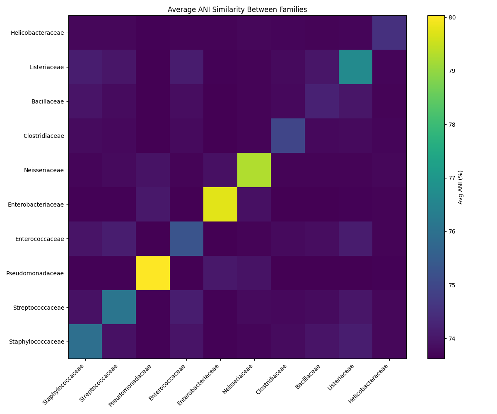
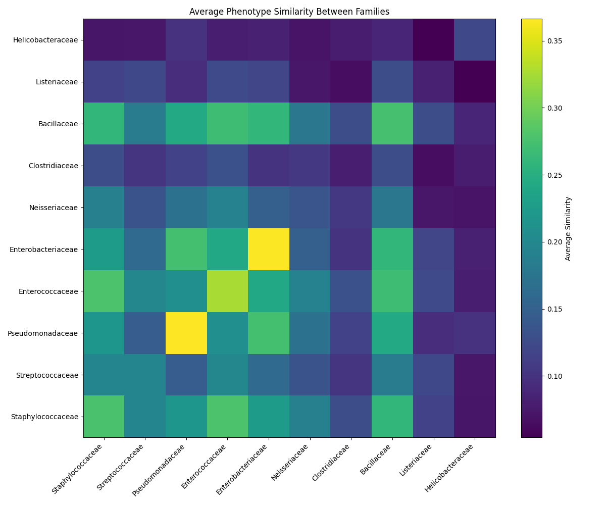

bacterial genotype phenotype similarity measures

Comparing ANI to bacterial phenotypic similarity

# Prerequisites
-ubuntu
-miniconda

For each of the steps, check to see if you need to swap out any paths at the top of the files

## Steps (skip to step ... if you are not pre-processing data)
### 1. Install conda environment
```bash
conda env create -f env.yml
```

At this point, if you run into trouble installing from the conda env.yml file , try creating a new conda environment with required dependencies

```bash
conda create -n bioinfo -c conda-forge -c bioconda python=3.12 fastani pandas
pip install bacdive
```

### 2. Download data from GTDB and BacDive (with scripts in /download_data)
First you will need a list of species names. I searched for type strains and downloaded a .csv from NCBI, resulting in a file advsearch_bacdive_2025-03-09.csv, which is included in this repo. Make a directory named "data" and paste this .csv into the data directory.

You will need an account on BacDive (https://bacdive.dsmz.de/), paste these credentials in the file BacDive_download_typestrains_fromspecies.py, which downloads the phenotypic data from BacDive in two halves. 

Because of possible API limitations, it is recommended to download BacDive data from this script save first half by specifying "first_half" in the line 
```python
species_list = first_half["species"].dropna().unique()
```
then
```python
species_list = second_half["species"].dropna().unique()
```
and saving to 

 bacdive_type_strains_results_first_half.csv
 bacdive_type_strains_results_second_half.csv

The GTDB download script should work right away

 
### 3. Preprocess the data

Run both BacDive_preprocess.py, GTDB_preprocess.py, and combine_GTDB_BacDive_preprocess.py making sure to match paths corectly.
```bash
python BacDive_preprocess.py
python GTDB_preprocess.py
python combine_GTDB_BacDive_preprocess.py
```

### 4. Run ANI/phenotypic similarity comparison
If you have skipped to this step, make a data directory and copy final_csv.csv and final_fam_csv.csv into data/
```bash
mkdir data
cp final_csv.csv data/
cp final_fam_csv.csv data/
```
final_csv.csv is the entire preprocessed data containing phenotypic representations as well as path needed for fastANI to run. This is unlikely to run on a home desktop. It is suggested to stick with final_fam_csv.csv, as there is only ~350 strains in this as opposed to ~4,000 strains, which requires high memory space. 

Both preprocessed csv's contain phenotypic data such as morphology, Gram stain, motility, and biochemical response tests for bacterial type strains as well as the corresponding GTDB genome path. 

If you are using either of the preprocessed csv's, check paths and file names. You will need to change path names in the csv under column 'gtdb_path' corresponding to where your GTDB genome data is held. This is otherwise taken care of in step 3.

You can at this point run: 

```python
python data_stats.py 
```

to see a breakdown of the available strains and some basic properties

Finally run the following to end up with the bacterial similarity comparison:

```python
python fastANI_run.py
python pheno_similarity.py
python genome_similarity.py
python strain_similarity.py
```

A breakdown of average inter- and intra- strain family similarity should be generated, like below:






